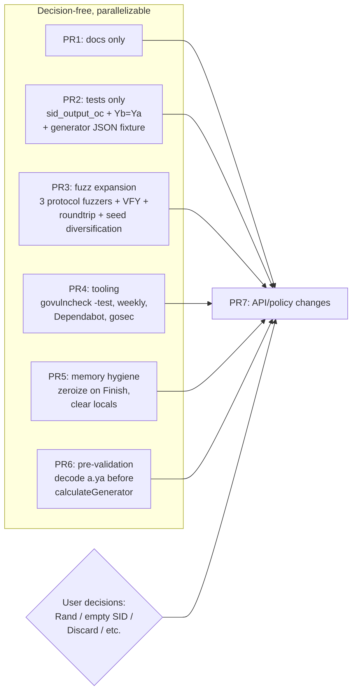

# Interview Results Triage

Date: 2026-05-05

This document triages `interview_results.md`, the synthesized report from four
parallel review agents. Treat `interview_results.md` as raw synthesis. Some
reported "during-interview" changes were made only in agent sandboxes and are
not present in the current tree.

## Status

This triage is historical. The decision-free action plan was implemented in
PRs #2-#8, and landing notes were recorded in `DEV-JOURNAL.md`. The current
living plan for remaining policy/API work is `docs/project-plan.md`.

## Current Tree Corrections

Verified against this checkout on 2026-05-05:

| Report claim | Current tree |
| --- | --- |
| `testdata/draft21-ristretto255-generator.json` was added | Not present |
| `sid_output_oc` assertion was added | Not present; `vectors_test.go` asserts only `sid_output_ir` |
| Fuzz matrix was expanded to 13 targets | Not present; `.github/fuzz-targets.json` has 7 targets |
| Captured corpus seed under `testdata/fuzz/FuzzDecodeMessageC/...` exists | Not present |
| README contained "RFC 9382" | Not present; this finding appears fabricated in the transcripts |

The convergent findings that remain credible are those with consistent
file:line evidence across agents, especially `Config.Rand`, the zero-scalar
retry in `sampleScalar`, `SessionID` policy, fuzz coverage gaps, and retained
ISK state.

## Triage by Section

Buckets:
- **ACT** — straightforward to plan and implement
- **DECIDE** — needs a policy/API call from the user before implementation
- **DOC** — documentation/comment clarity, no code change
- **INVESTIGATE** — needs more research before deciding
- **IGNORE** — already correct, or value < cost

| Section | Bucket | Disposition |
| --- | --- | --- |
| Q1 curve math delegation | IGNORE | Informational only. Curve math is delegated to `gtank/ristretto255` and `filippo.io/edwards25519`; protocol logic is local. |
| Q2 state machine | DOC | In-package skip/downgrade analysis is sound. Add a note that outer application PAKE/version negotiation needs its own downgrade protection. |
| Q3 constant-time comparisons | IGNORE/DOC | `hmac.Equal` is functionally correct. A direct `crypto/subtle` swap is cosmetic unless policy requires the literal symbol. Optional: comment that the identity check uses `hmac.Equal` as fixed-length byte comparison. |
| Q4 timing | DECIDE/DOC | Decide whether to keep the negligible zero-scalar retry or change scalar sampling. Document password-length-proportional work more explicitly. |
| Q5 transcript hashing | DOC | Audit is clean. Add a short `deriveISK` comment explaining the fixed-size injectivity invariant. |
| Q6 tooling | ACT/INVESTIGATE | Add `govulncheck -test`, scheduled vulnerability scan, dependency updater. Add `gosec` first as advisory/non-blocking. Investigate Scorecard, CodeQL, Capslock, OSS-Fuzz separately. |
| Q7 strict no-early-exit/no-lookups | Same as Q3/Q4 | No secret-indexed lookups found. Only strict early-exit concern is zero-scalar retry. |
| Q8 Go crypto pitfalls | DECIDE/ACT | `Config.Rand` policy is the most important decision. Add best-effort clearing of owned temporaries/state, while documenting Go's zeroization limits. Decide on `Session.Discard()`. |
| Q9 draft vectors | ACT | Add missing generator fixture and `sid_output_oc` assertion. Ignore out-of-suite vectors unless new suites are implemented. |
| Q10 adversarial findings | DECIDE/ACT/DOC | Decide `Config.Rand`, empty `SessionID`, role-separated tags, peer AD accessor, max field length. Add pre-decode of public `a.ya`, reflected-share test, and integration warnings. |
| Q11 fuzz inventory | ACT | Add protocol-entry fuzzers, direct point-deserialization fuzz, round-trip fuzzers, seeds, and matrix entries. |
| Q12 differential/adversarial fuzz | ACT/INVESTIGATE | Do Q11 first. Investigate an offline Sage-generated vector dataset. Ignore live Sage subprocess fuzzing for normal CI. |

### Q1 — curve math delegation
- IGNORE. Report is informational; nothing to do.

### Q2 — state machine (skip / replay / downgrade)
- IGNORE in-package; the analysis is sound. `consume()` at
  `api.go:209-227` is the single-use latch.
- DOC: in `docs/security-assessment.md`, note explicitly that downgrade
  protection assumes any *outer* PAKE-version negotiation in the application
  has its own protection. Currently absent.

### Q3 — `crypto/subtle` correctness
- IGNORE the literal-symbol gap. `hmac.Equal` (used at `api.go:179`,
  `api.go:203`, `crypto.go:86`) wraps `subtle.ConstantTimeCompare`.
  Functional correctness is established. Swapping is cosmetic.
- DOC (small, optional): at `crypto.go:86`, comment that `hmac.Equal` is
  being used as a fixed-length byte comparison (semantically a
  `subtle.ConstantTimeCompare`), not a MAC equality check.

### Q4 — timing review
- DECIDE: `sampleScalar` zero-retry loop at `crypto.go:53`. Two options:
  1. Keep the retry. Probability ≈ 2⁻²⁵² with `crypto/rand`. Strict policy
     violation only matters if a hostile `Config.Rand` is permitted (linked
     to Q8/Q10 RNG decision).
  2. Investigate `Scalar.SetUniformBytes`-based sampling from 64 random bytes.
     This avoids canonical-decode rejection, but it still needs a conformance
     and distribution review, including whether zero output must still be
     rejected.
- DOC: extend "Secret-Dependent Behavior" in
  `docs/security-assessment.md:11-32` to call out the password-length-
  proportional work in `generatorString`/`normalizeConfig` more explicitly.
  Current text mentions short-password block alignment but does not say
  longer passwords leak length.

### Q5 — transcript hashing
- IGNORE: protocol audit is clean. `transcriptIR`/`transcriptOC` at
  `strings.go:35-43` are LEB128 length-value concatenations.
- DOC (small): at `crypto.go:92` `deriveISK`, add a one-line comment noting
  the injectivity argument is load-bearing on `pointSize=32` and
  `tagSize=64` (a similar comment already exists for `confirmationTag` at
  `crypto.go:101-102`).

### Q6 — tooling
- ACT: change `task vuln` (`Taskfile.yml:39-42`) to `govulncheck -test ./...`
  so test-only deps are scanned (Codex confirmed deps differ: 141 vs 106).
- ACT: add a scheduled (weekly) workflow that runs `task vuln` so newly
  disclosed CVEs surface without waiting for a PR. New file
  `.github/workflows/vuln.yml`.
- ACT: enable Dependabot (`.github/dependabot.yml`) for `gomod` and
  `github-actions`. The pinned tool versions live in `ci.yml:39-40` not in a
  `tools/` go.mod, so a `tools` ecosystem entry is not needed.
- ACT: add `gosec` first as an advisory/non-blocking task or workflow.
  Crypto-specific G401–G505 rules are useful here, but triage false positives
  before making it a hard lint gate.
- INVESTIGATE: OpenSSF Scorecard, OSS-Fuzz, Capslock, CodeQL — each is a
  separate decision; pick one at a time. Scorecard is the cheapest.
- IGNORE for now: OSV-Scanner (overlap with `govulncheck`), Go 1.24 `tool`
  directives in `go.mod` (no impact today).

### Q7 — strict subtle/early-exit/lookups
- Same as Q3 + Q4. No new buckets.

### Q8 — Go pitfalls (constant-time / RNG / zeroing)
- DECIDE: `Config.Rand` exposure (`api.go:47-50`). Highest-impact decision in
  the report. Three options:
  1. Leave as-is, doc-only. Status quo.
  2. Remove from public `Config`, expose only via an `internal/test` hook
     used by tests (would touch every Rand line in `api_test.go` and
     `fuzz_test.go`).
  3. Keep public but add an explicit unsafe/test opt-in; reject `cfg.Rand !=
     nil` when the opt-in is false. Do not try to prove an arbitrary
     `io.Reader` is equivalent to `crypto/rand.Reader`.
- ACT (low risk, high value): best-effort cleanup on `Initiator.Finish` and
  `Responder.Finish` (`api.go:161` and `api.go:191`) — drop `i.scalar`, clear
  `r.isk`, and clear `r.transcript`. Dropping `i.scalar` releases the reference;
  it does not zero the scalar internals. Best-effort only (Go GC limits) but
  cheap.
- ACT: clear `keyInput` and `macKey` in `confirmationTag` (`crypto.go:99-108`)
  before return; clear local `b` in `sampleScalar` after `SetCanonicalBytes`
  (`crypto.go:42-59`); clear `genStr` in `calculateGenerator` after
  `SetUniformBytes` (`crypto.go:32-40`); clear `nc.password` after generator
  computation in `Start`/`Respond` (`api.go:99-114`, `api.go:118-156`).
- DECIDE: add `Session.Discard()` that zeros `s.isk` and makes future
  `Export` error. Public API surface addition. `Session` is currently
  `{isk, transcriptID}` at `api.go:79-82`.

### Q9 — draft-21 vector coverage
- ACT: assert `sid_output_oc` against the JSON fixture in `vectors_test.go`.
  The data is already in `testdata/draft21-ristretto255-sha512.json`; only
  one new comparison is needed (mirrors `vectors_test.go:234-238` for
  `sid_output_ir` but using `transcriptOC`).
- ACT: add `testdata/draft21-ristretto255-generator.json` covering Appendix
  B.3.1.1 generator string (the report says this was added; it was not).
  Pin SHA-256 alongside the existing fixtures (`vectors_test.go:19-22`).
- IGNORE: X25519 / X448 / P-256 / P-384 / P-521 / Decaf448 vectors. Out of
  suite — package implements only `CPACE-RISTR255-SHA512`.
- IGNORE: live Sage differential. Practical only as a Tier 1
  offline-generated extended-vector dataset (see Q12).

### Q10 — adversarial findings
- High: `Config.Rand` — same as Q8 DECIDE.
- Medium DECIDE: empty `SessionID` policy. Reject by default + opt-in escape
  hatch (e.g. `Config.AllowEmptySessionID`), or stay draft-permissive?
  Currently permissive at `api.go:39-51` and documented as such in README.
- Medium DECIDE: confirmation tag role separation (add `"A"`/`"B"` label
  inside `confirmationTag` MAC input at `crypto.go:99-108`). Hardens against
  scalar/AD reflection but is a draft-compatibility break.
- Medium ACT: pre-decode `a.ya` before `calculateGenerator` in `Respond`
  (`api.go:118-144`). Reduces password hashing under garbage A; ~5 lines.
- Medium DECIDE: `PeerAssociatedData()` accessor on `Initiator`/`Responder`.
  Public-API decision. The fields exist (`api.go:54-76`) but are unexported.
- Medium ACT (test-only): add a separate "reflected initiator share" test
  (`Yb = Ya`) that expects `ErrConfirmationFailed`, not `ErrAbort`. The share
  is a valid Ristretto point; confirmation tag verification is what blocks the
  reflection.
- Medium DOC: README/doc.go — add a worked example showing the
  role-identifier reversal failure mode (Alice setting `InitiatorID:"Alice"`
  while Bob sets `InitiatorID:"Bob"`). Cheapest way to prevent the day-loss
  bug Gemini called out.
- Medium DOC: add a worked example warning against hardcoded IDs
  (`"client"`/`"server"` for all users) destroying domain separation.
- Medium DOC: explicitly say "`Respond` returning success does NOT imply
  authentication; only `Initiator.Finish` and `Responder.Finish` succeeding
  do."
- Low ACT: README — already correct on draft-21; ignore the "RFC 9382"
  finding (fabricated). However: add the qualifier "passes the official test
  vectors *for the implemented Ristretto255/SHA-512 suite*" — that part is
  fair and worth the eight-word edit.
- Low DOC: `Session.TranscriptID` (`session.go:13-18`) as draft
  `CPaceSidOutput` (X1's "overinterpretation" concern). Add one-line
  clarification that this is the draft sid output, not full channel binding.
- Low DECIDE: parser `maxFieldLength = 1<<20` (`framing.go:11-13`). Lower
  default? Caller-configurable cap? Today's value is fine but worth a
  maintainer call.
- Low IGNORE: SHA-512 length-extension comment by C. The `macKey`
  (`crypto.go:104`) is internal; not exploitable. Mention only if revising
  the construction.
- Low DOC: `Export` "not a randomness pool" — add a note in `session.go:20-22`
  that callers should derive each application key with a distinct
  `(label, context)`, not request a 16KB chunk and slice it.
- Low DOC: generator-padding edge case — at `crypto.go:24-30` add a comment
  that the trailing `-1` accounts for the LEB128 prefix on the zero-padding
  field, which assumes `zpadLen < 128` (and would need revisiting if
  `sInBytes` increased).

### Q11 — fuzzing inventory
Current state: 7 targets in `.github/fuzz-targets.json`; all are decoder or
JSON-loader fuzzers plus the two protocol consistency/mismatch fuzzers in
`fuzz_test.go:44-115`.

- ACT: add the three "wire-message-into-protocol" fuzz targets:
  - `FuzzRespondWithFuzzedMessageA`
  - `FuzzInitiatorFinishWithFuzzedMessageB`
  - `FuzzResponderFinishWithFuzzedMessageC`

  Each ~25 lines; assert no panic, only expected error classes
  (`ErrMessage`/`ErrAbort`/`ErrConfirmationFailed`/`ErrInvalidInput`); assert
  state is consumed exactly once (re-call returns `ErrStateUsed`).
- ACT: add `FuzzScalarMultVFY` over arbitrary 32-byte point bytes with a
  fixed scalar (target lives in `crypto.go:76-90`).
- ACT: add roundtrip fuzz `FuzzMessageA/B/CRoundTrip` (encode→decode equality
  on the structured fields).
- ACT: register all new targets in `.github/fuzz-targets.json`.
- ACT: diversify seed corpora — currently each target has a single
  `f.Add(...)` (`fuzz_test.go:10,17,24,31,38,45,85`). Add 3–5 valid-and-
  invalid seeds per target.
- ACT: raise the per-input length cap in
  `FuzzProtocolConsistency`/`FuzzProtocolMismatch` from 1024
  (`fuzz_test.go:47, fuzz_test.go:87`) toward `maxFieldLength = 1MiB`, or
  pick a smaller deliberate cap and document it. Today's 1024 is well below
  the actual parser limit.

### Q12 — adversarial fuzzing & differential
- ACT (subset of Q11 ACTs above).
- INVESTIGATE: Tier 1 differential dataset. One-off: install Sage in a
  worktree, generate 1000+ extended vectors, embed JSON, fuzzer indexes
  into the dataset and asserts equality. No Sage in CI. ~half a day.
- IGNORE: live Sage differential in CI / Tier 2.
- IGNORE: Tier 3 round-trip fuzz (covered by Q11 ACT).

## Decisions Needed

Order these decisions by blast radius and how many findings they unlock.

1. **`Config.Rand` policy**
   - Keep as-is with stronger docs.
   - Remove from public `Config` and use internal/test hooks.
   - Keep public but require an explicit unsafe/test opt-in.
   This affects the RNG footgun, the practical relevance of scalar-retry timing,
   replay misuse scenarios, and confirmation-tag reflection discussions.

2. **`SessionID` policy**
   - Stay draft-permissive and keep accepting empty sid.
   - Reject empty sid by default with an explicit compatibility escape hatch.

3. **`Session.Discard()`**
   - Add a public lifecycle method that clears `Session.isk` and makes future
     `Export` calls fail, or keep the API simpler and only clear internal state.

4. **Peer associated data access**
   - Add accessors such as `PeerAssociatedData()` to reduce application-layer
     TOCTOU mistakes, or keep messages opaque.

5. **Confirmation tag role separation**
   - Adding role labels hardens misuse/reflection cases, but it is a
     draft-compatibility/profile break. Do not change this without an explicit
     package-profile decision.

6. **`maxFieldLength`**
   - Keep the 1 MiB parser cap, lower it, or add a caller-configurable cap.

7. **Scalar sampling method**
   - Keep masked canonical sampling with zero retry, or investigate a
     `SetUniformBytes`-based approach. Treat this as a protocol-conformance
     decision, not a mechanical cleanup.

## Action Plan

The seven proposed PRs split into two layers: six are independent of any
user decision; one rolls in the policy decisions and lands last.

### 1. Docs PR

Low risk and cheap. Clarify:

- `Respond` success does not authenticate the initiator; only successful
  `Initiator.Finish` and `Responder.Finish` produce authenticated sessions.
- Role identifiers must be oriented consistently by both parties. Avoid the
  common "each side puts itself first" bug.
- Hardcoded identities like `"client"` and `"server"` across all users weaken
  domain separation.
- `SessionID` must be fresh, non-secret, and agreed by both parties.
- `TranscriptID` is the draft `CPaceSidOutput`, not a complete channel binding
  over application negotiation.
- `Export` output should not be treated as a randomness pool; derive each
  application key with a distinct `(label, context)`.
- Outer protocol/version negotiation needs its own downgrade protection.
- `generatorString` padding has a SHA-512/block-size assumption that must be
  revisited if `sInBytes` changes.
- `deriveISK` raw transcript append is unambiguous because this suite has fixed
  point and hash output sizes.

### 2. Test And Vector PR

- Add `testdata/draft21-ristretto255-generator.json` from Appendix B.3.1.1.
- Pin its SHA-256 alongside the existing fixture hashes.
- Assert `sid_output_oc` from the existing Ristretto JSON fixture.
- Add a reflected-share test where `Yb = Ya`; confirmation should fail with
  `ErrConfirmationFailed`.

### 3. Fuzz Expansion PR

- Add `FuzzRespondWithFuzzedMessageA`.
- Add `FuzzInitiatorFinishWithFuzzedMessageB`.
- Add `FuzzResponderFinishWithFuzzedMessageC`.
- Add `FuzzScalarMultVFY` over arbitrary encoded point bytes.
- Add `FuzzMessageA/B/CRoundTrip`.
- Register all new targets in `.github/fuzz-targets.json`.
- Add several valid, truncated, malformed, identity-point, and invalid-point
  seeds per target.
- Revisit the 1024-byte cap in protocol fuzzers. Either raise it toward
  `maxFieldLength` or document it as a deliberate fuzz-budget cap.

### 4. Tooling PR

- Change `task vuln` to `govulncheck -test ./...`.
- Add a weekly vulnerability workflow.
- Add a dependency updater:
  - Dependabot is enough for `gomod` and GitHub Actions.
  - Renovate is better if pinned `go install ...@vX.Y.Z` versions in workflow
    shell scripts should be updated automatically.
- Add `gosec` first as advisory/non-blocking, then decide later whether to make
  it a hard gate.

### 5. Memory Hygiene PR

Best-effort cleanup only; do not claim Go memory-disclosure resistance.

- Clear responder `isk` and `transcript` after `Responder.Finish`.
- Drop `Initiator.scalar` after `Initiator.Finish`.
- Clear local byte-slice temporaries such as `keyInput`, `genStr`, and scalar
  sample buffers where ownership is clear.
- Be careful with `nc.password`: it is an owned clone, but clearing should only
  happen after generator computation no longer needs it.

### 6. Prevalidation PR

Pre-decode public `a.ya` in `Respond` before `calculateGenerator` and scalar
sampling. This reduces password-hashing and RNG work for garbage public shares.
Use the same Ristretto canonical decoding semantics as `scalarMultVFY` to avoid
semantic drift.

### 7. API/Policy PRs (after decisions)

After the decisions above, implement the selected policy changes for
`Config.Rand`, empty `SessionID`, `Session.Discard()`, peer AD accessors,
confirmation tag role separation, `maxFieldLength`, and scalar sampling.

## Investigate Later

- OpenSSF Scorecard, CodeQL, Capslock, and OSS-Fuzz. Pick one at a time;
  Scorecard is the cheapest first step.
- Tier 1 Sage-derived vector dataset: generate many offline vectors with the
  CFRG Sage PoC and embed them as JSON. Do not run Sage inside normal fuzzing.
- Allocation measurements on hot paths with `testing.AllocsPerRun`; use this as
  evidence before adding permanent allocation tests.

## Ignore Or Watch

- Literal `crypto/subtle` import gap: `hmac.Equal` is correct for current code.
- README "RFC 9382" finding: false in this tree.
- SHA-512 length-extension concern around internal `macKey`: not exploitable as
  written because the key is not exposed.
- Live Sage subprocess differential fuzzing in CI: too slow and brittle for the
  normal gate.
- Curve-level implementation concerns: delegated to reviewed dependencies.
- In-package suite downgrade: no negotiation surface exists today.

## Verification For Each PR

- `task check`
- `FUZZTIME=30s PARALLEL=2 task fuzz`
- For new vector fixtures: SHA-256 pinning and bit-equality against the CFRG
  draft vector source.
- For fuzz expansion: every new target appears in `.github/fuzz-targets.json`
  and reports PASS in the matrix log.
- For memory hygiene: manual aliasing review plus normal tests; do not rely on
  tests to prove zeroization.
